<p align="center">
  
</p>

<h1 align="center">Bitácora Digital de Administración de Redes</h1>

<p align="center">
  <strong>Aplicación móvil multiplataforma para la gestión de redes, subredes y dispositivos</strong>
</p>

<p align="center">
  
  
  
  
</p>

---

## 📋 Información del Proyecto

| Campo | Detalle |
|-------|---------|
| **Asignatura** | Administración de Redes |
| **Docente** | M.B.A. Jonathan Zacek Alcazar Jurado |
| **Proyecto** | Bitácora Digital de Administración de Redes |
| **Semestre** | 9° Semestre |
| **Fecha** | Agosto 2026 |
| **Institución** | Instituto Tecnologico Superior de Uruapan |

### 👥 Integrantes del Equipo

| # | Nombre | GitHub |
|---|--------|--------|
| 1 | Juan Eduardo Rojas Rivas | [@EduardoRivas25](https://github.com/EduardoRivas25) |
| 2 | Juan Manuel Moreno Garcia | [@juanitoelorigi](https://github.com/juanitoelorigi) |
| 3 | Guadalupe Jazmin Becerra Morales | [@JazBM21](https://github.com/JazBM21) |
| 4 | German Jafet Orozco Rios | [@Itachi1902a](https://github.com/Itachi1902a) |
| 5 | Salvador Alejandro Lopez Duarte | [@Alex201-cpu](https://github.com/Alex201-cpu) |

---

## 📖 Introducción

La **Bitácora Digital de Administración de Redes** es una aplicación móvil multiplataforma desarrollada con **React Native** y **Expo** que permite a los administradores de red gestionar de manera eficiente la infraestructura de red de una organización.

La aplicación proporciona herramientas para registrar, consultar, modificar y eliminar redes, subredes y dispositivos, manteniendo un inventario completo y organizado de todos los componentes de la infraestructura.

### 🎯 Justificación

En el ámbito de la administración de redes, es fundamental contar con un registro detallado y actualizado de todos los componentes que conforman la infraestructura. Los métodos tradicionales basados en hojas de cálculo o documentos físicos presentan múltiples limitaciones:

- **Falta de accesibilidad**: No es posible consultar la información desde cualquier lugar.
- **Riesgo de inconsistencias**: La actualización manual genera errores y datos duplicados.
- **Búsquedas ineficientes**: Localizar un dispositivo específico por IP o MAC es lento y tedioso.
- **Sin validación de datos**: No se verifican formatos de direcciones IPv4 o MAC.

Esta aplicación resuelve estos problemas al ofrecer:

- ✅ **Acceso multiplataforma** (iOS, Android y Web) desde cualquier dispositivo.
- ✅ **CRUD completo** para redes, subredes y dispositivos.
- ✅ **Validaciones automáticas** de direcciones IPv4 y MAC.
- ✅ **Buscador integrado** por nombre, IP, MAC, fabricante y ubicación.
- ✅ **Interfaz moderna e intuitiva** con diseño oscuro profesional.
- ✅ **Almacenamiento en la nube** con Supabase (PostgreSQL).

---

## 🛠️ Tecnologías Utilizadas

| Tecnología | Versión | Descripción |
|------------|---------|-------------|
| [React Native](https://reactnative.dev/) | 0.86.3 | Framework multiplataforma para apps móviles |
| [Expo](https://expo.dev/) | SDK 57 | Plataforma de desarrollo y compilación |
| [TypeScript](https://www.typescriptlang.org/) | 6.0 | Lenguaje con tipado estático |
| [React Navigation](https://reactnavigation.org/) | 7.x | Navegación entre pantallas |
| [Supabase](https://supabase.com/) | - | Backend as a Service (PostgreSQL + Auth) |
| [Expo Vector Icons](https://icons.expo.fyi/) | - | Biblioteca de iconos |

---

## 🚀 Guía de Instalación y Ejecución

### Prerequisitos

Asegúrate de tener instalado:

- **Node.js** (v18 o superior) — [Descargar](https://nodejs.org/)
- **npm** (incluido con Node.js)
- **Expo CLI** (se instala automáticamente)
- **Expo Go** (app móvil) — [Android](https://play.google.com/store/apps/details?id=host.exp.exponent) | [iOS](https://apps.apple.com/app/expo-go/id982107779)

### 1. Clonar el repositorio

```bash
git clone https://github.com/USUARIO/bitacora-redes.git
cd bitacora-redes
```

### 2. Instalar dependencias

```bash
npm install
```

### 3. Configurar variables de entorno

Crear un archivo `.env` en la raíz del proyecto con las credenciales de Supabase:

```env
EXPO_PUBLIC_SUPABASE_URL=https://tu-proyecto.supabase.co
EXPO_PUBLIC_SUPABASE_ANON_KEY=tu-anon-key-aqui
```

> **Nota:** Contactar al equipo para obtener las credenciales de Supabase si no las tienes.

### 4. Ejecutar la aplicación

```bash
# Iniciar el servidor de desarrollo
npx expo start

# Opciones específicas por plataforma:
npx expo start --android    # Solo Android
npx expo start --ios        # Solo iOS
npx expo start --web        # Solo Web
```

### 5. Abrir en dispositivo

- **Expo Go (móvil):** Escanea el código QR que aparece en la terminal con la app Expo Go.
- **Emulador Android:** Presiona `a` en la terminal.
- **Simulador iOS:** Presiona `i` en la terminal (solo macOS).
- **Navegador Web:** Presiona `w` en la terminal.

---

## 🔐 Credenciales de Prueba

Para acceder a la aplicación, utiliza las siguientes credenciales proporcionadas por el docente:

| Campo | Valor |
|-------|-------|
| **Correo electrónico** | `prueba1@gmail.com` |
| **Contraseña** | `contra123` |

<!-- 
  NOTA: Reemplazar con las credenciales reales proporcionadas por el docente.
  Las credenciales actuales son de ejemplo.
-->

> ⚠️ **Importante:** Estas credenciales son exclusivamente para fines de evaluación y pruebas de la aplicación.

---

## 📱 Capturas del Funcionamiento

### Pantalla de Inicio de Sesión

<!-- Captura de la pantalla de login -->
<p align="center">
  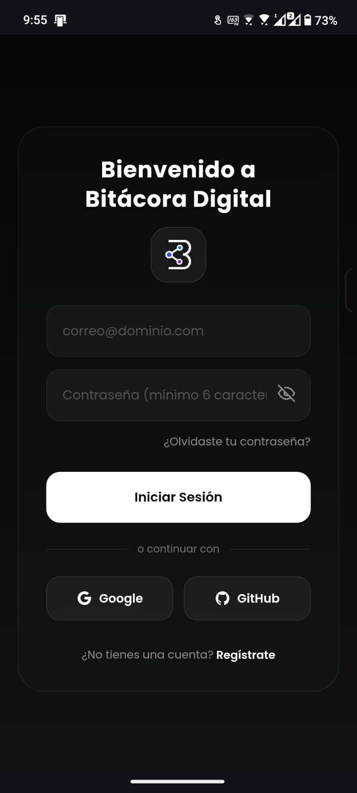
</p>

<p align="center"><em>Pantalla de autenticación con validación de credenciales</em></p>

### Pantalla Principal (Dashboard)

<!-- Captura del dashboard -->
<p align="center">
  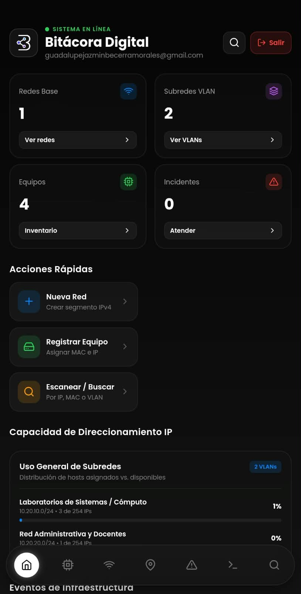
</p>

<p align="center"><em>Panel principal con estadísticas de redes, subredes, dispositivos y alertas</em></p>

---

## 📝 Evidencias del CRUD

### Gestión de Redes

#### Crear Red

<!-- Captura de crear red -->
<p align="center">
  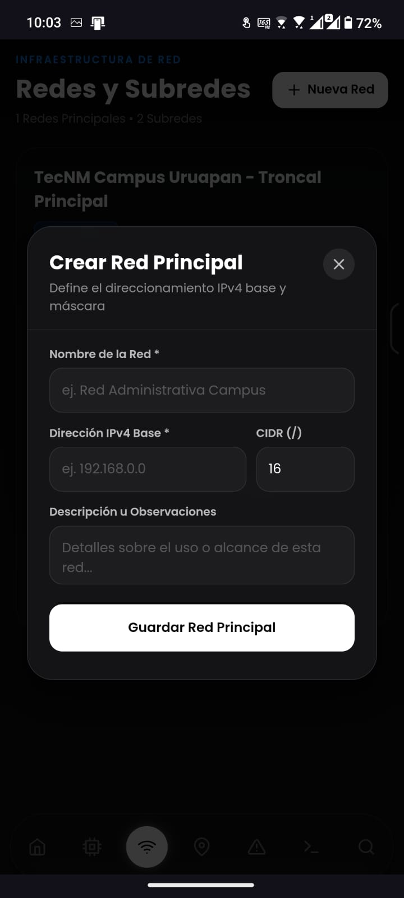
</p>

<p align="center"><em>Formulario de creación de una nueva red con validación de dirección IPv4 y CIDR</em></p>

#### Consultar Redes

<!-- Captura de lista de redes -->
<p align="center">
  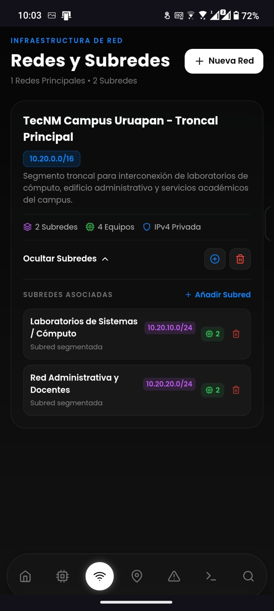
</p>

<p align="center"><em>Listado completo de redes registradas con información resumida</em></p>

#### Detalle de Red

<!-- Captura del detalle de red -->
<p align="center">
  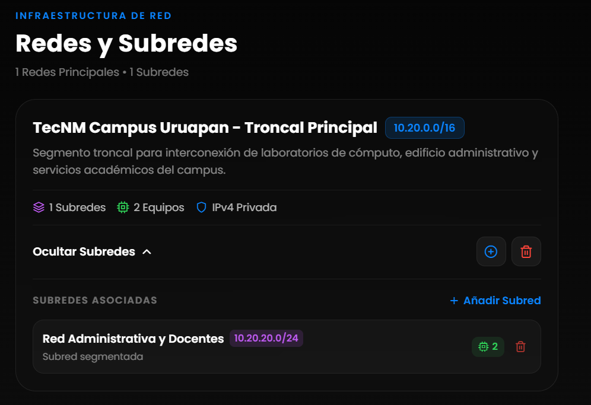
</p>

<p align="center"><em>Detalle de red con subredes asociadas e información de direccionamiento</em></p>

#### Eliminar Red

<!-- Captura de eliminar red -->
<p align="center">
  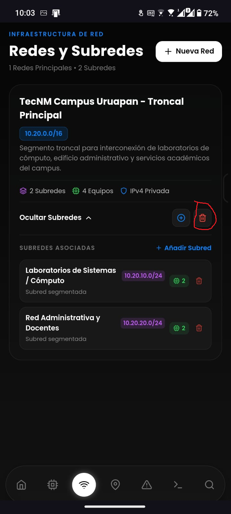
</p>

<p align="center"><em>Confirmación antes de eliminar una red y sus subredes/dispositivos asociados</em></p>

---

### Gestión de Subredes

#### Crear Subred

<!-- Captura de crear subred -->
<p align="center">
  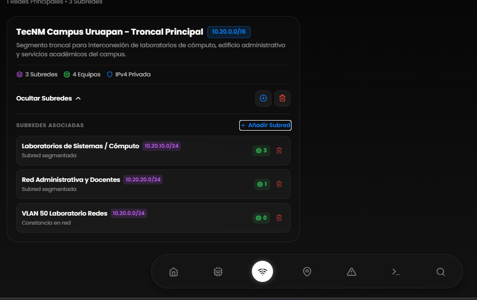
</p>

<p align="center"><em>Creación de subred con validación de que pertenezca a la red padre</em></p>

#### Consultar Subredes

<!-- Captura de lista de subredes -->
<p align="center">
  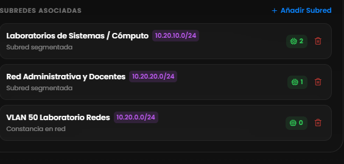
</p>

<p align="center"><em>Subredes asociadas a una red específica</em></p>

#### Eliminar Subred

<!-- Captura de eliminar subred -->
<p align="center">
  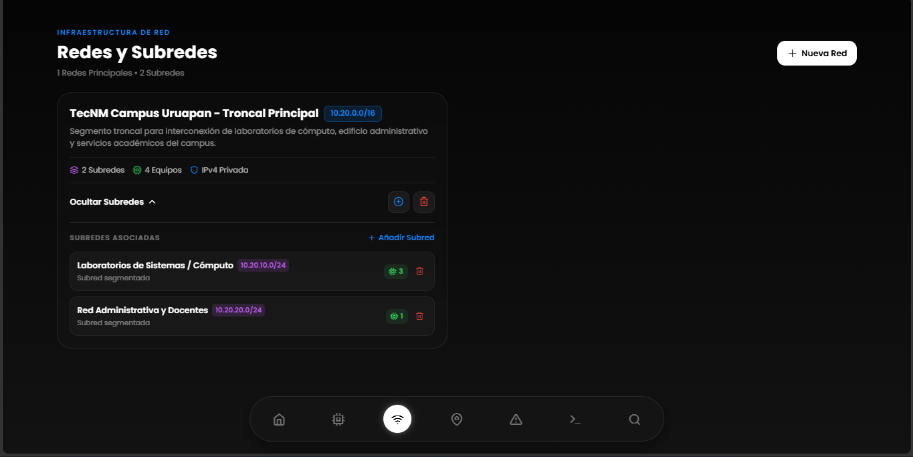
</p>

<p align="center"><em>Confirmación de eliminación de subred</em></p>

---

## 📦 Evidencias del Inventario de Dispositivos

### Crear Dispositivo

<!-- Captura de crear dispositivo -->
<p align="center">
  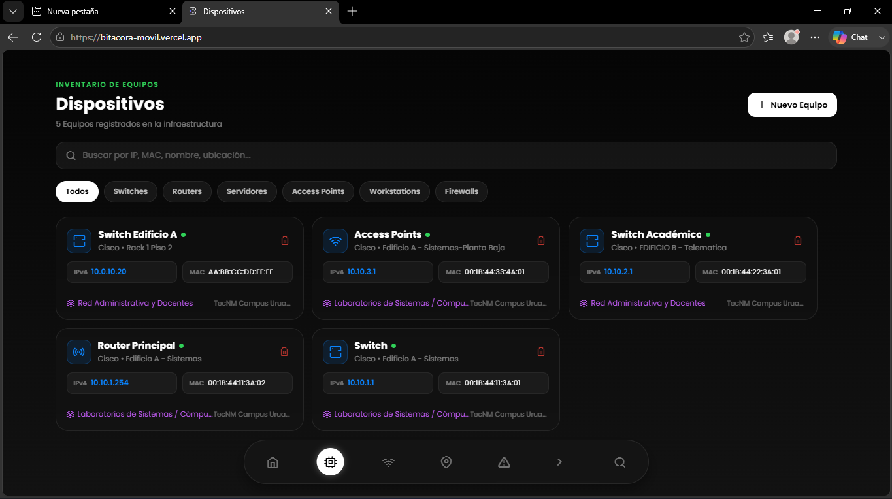
</p>

<p align="center"><em>Registro de nuevo dispositivo con validación de IPv4 y MAC (XX:XX:XX:XX:XX:XX)</em></p>

### Consultar Dispositivos

<!-- Captura de lista de dispositivos -->
<p align="center">
  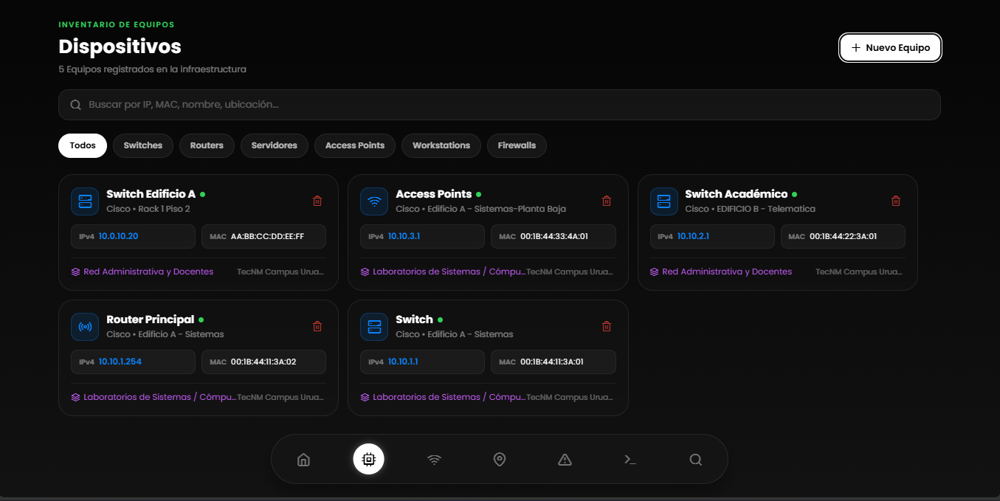
</p>

<p align="center"><em>Inventario completo de dispositivos con nombre, IP, MAC, fabricante y ubicación</em></p>

### Detalle de Dispositivo

<!-- Captura del detalle de dispositivo -->
<p align="center">
  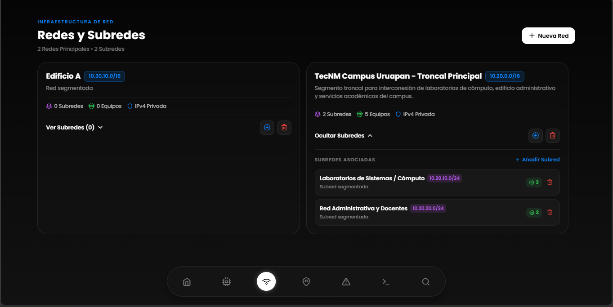
</p>

<p align="center"><em>Información completa del dispositivo: nombre, dirección MAC, fabricante, ubicación, IPv4 y red/subred asociada</em></p>

### Modificar Dispositivo

<!-- Captura de editar dispositivo -->
<p align="center">
  
</p>

<p align="center"><em>Edición de datos de un dispositivo registrado</em></p>

### Eliminar Dispositivo

<!-- Captura de eliminar dispositivo -->
<p align="center">
  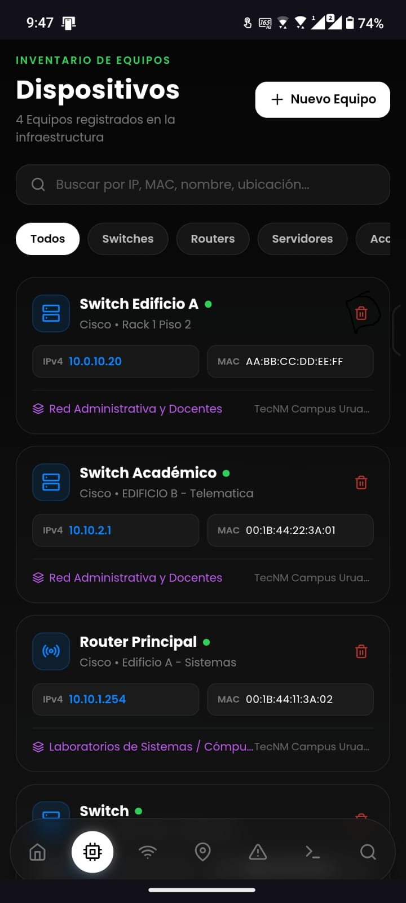
</p>

<p align="center"><em>Confirmación de eliminación de dispositivo del inventario</em></p>

---

## 🔍 Evidencias del Buscador

### Búsqueda por Nombre

<!-- Captura de búsqueda por nombre -->
<p align="center">
  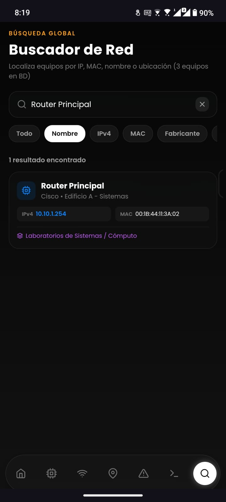
</p>

<p align="center"><em>Resultados de búsqueda filtrados por nombre de dispositivo</em></p>

### Búsqueda por Dirección IP

<!-- Captura de búsqueda por IP -->
<p align="center">
  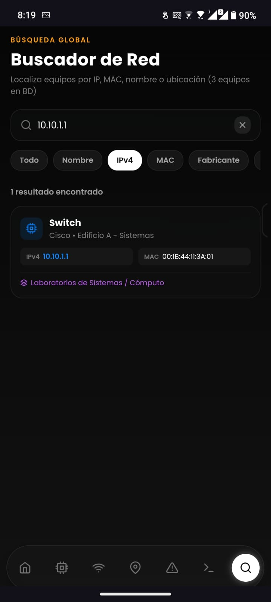
</p>

<p align="center"><em>Localización de dispositivo por dirección IPv4</em></p>

### Búsqueda por Dirección MAC

<!-- Captura de búsqueda por MAC -->
<p align="center">
  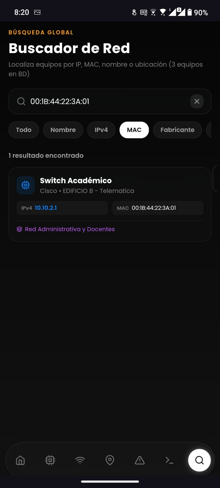
</p>

<p align="center"><em>Localización de dispositivo por dirección MAC</em></p>

### Búsqueda por Fabricante

<!-- Captura de búsqueda por fabricante -->
<p align="center">
  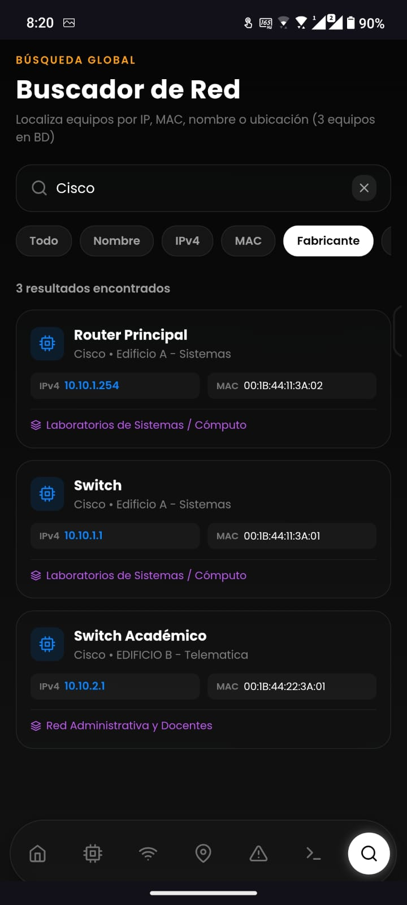
</p>

<p align="center"><em>Filtrado de dispositivos por fabricante</em></p>

### Búsqueda por Ubicación

<!-- Captura de búsqueda por ubicación -->
<p align="center">
  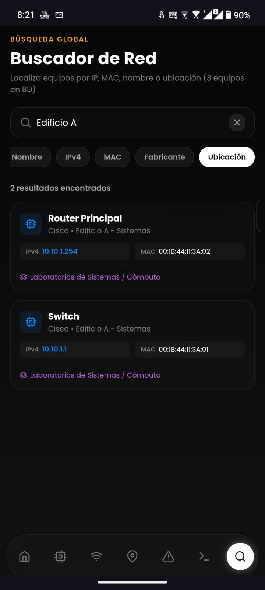
</p>

<p align="center"><em>Filtrado de dispositivos por edificio o ubicación</em></p>

---

## ✅ Validaciones Implementadas

| Validación | Descripción | Ejemplo |
|------------|-------------|---------|
| **IPv4** | Cada octeto entre 0 y 255, formato `X.X.X.X` | `192.168.1.100` ✅ / `999.0.0.1` ❌ |
| **MAC** | Formato hexadecimal `XX:XX:XX:XX:XX:XX` | `AA:BB:CC:DD:EE:FF` ✅ / `AABB.CCDD` ❌ |
| **CIDR** | Valor entre 0 y 32 | `/24` ✅ / `/33` ❌ |
| **Campos obligatorios** | Nombre, dirección, fabricante, ubicación | No permite campos vacíos |
| **Subred en red** | La subred debe estar contenida en la red padre | `192.168.1.0/26` en `192.168.1.0/24` ✅ |
| **IP en subred** | La IP del dispositivo debe pertenecer a su subred | `192.168.1.10` en `192.168.1.0/24` ✅ |

---

## 📂 Estructura del Proyecto

```
bitacora-redes/
├── App.tsx                          # Punto de entrada
├── index.ts                         # Registro de la app
├── app.json                         # Configuración de Expo
├── package.json                     # Dependencias
├── tsconfig.json                    # Configuración TypeScript
├── .gitignore                       # Archivos ignorados por Git
├── .env                             # Variables de entorno (no incluido en Git)
├── assets/                          # Recursos estáticos
├── capturas/                        # Capturas de pantalla para el README
└── src/
    ├── types/                       # Interfaces TypeScript
    ├── theme/                       # Colores, espaciado, tipografía
    ├── lib/                         # Cliente Supabase
    ├── utils/                       # Validaciones y cálculos de red
    ├── services/                    # Servicios CRUD (Supabase)
    ├── contexts/                    # Contextos de React (Auth)
    ├── components/                  # Componentes reutilizables
    │   ├── ui/                      # Botones, inputs, cards, etc.
    │   ├── network/                 # Tarjetas de red/subred
    │   └── device/                  # Tarjetas de dispositivos
    ├── screens/                     # Pantallas de la app
    │   ├── auth/                    # Login
    │   ├── dashboard/               # Panel principal
    │   ├── network/                 # Gestión de redes
    │   ├── subnet/                  # Gestión de subredes
    │   ├── device/                  # Inventario de dispositivos
    │   └── search/                  # Buscador
    └── navigation/                  # Navegación (Stack + Tabs)
```

---

## 📄 Licencia

Este proyecto fue desarrollado con fines académicos para la asignatura de Administración de Redes.

---

<p align="center">
  Hecho con ❤️ por el equipo de desarrollo — Agosto 2026
</p>
